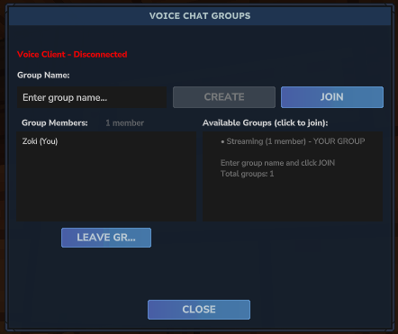

# Hytale Voice Chat

Proximity-based voice chat system for Hytale with WebRTC technology:

- **Web Client**: Browser-based WebRTC client (no installation required)
- **Hytale Plugin**: Server-side SFU (Selective Forwarding Unit) for media routing written in Java

---

## 🌐 Web Client

The web client is a **browser-based voice chat interface** that requires no installation. Uses WebRTC for peer connections with server-side selective forwarding.

### Features

- No installation required - runs directly in your browser
- WebRTC DataChannels with Opus codec for high-quality audio
- Built-in DTLS-SRTP encryption
- Cross-platform (any modern browser: Chrome, Firefox, Safari)
- Proximity-based spatial audio
- Microphone capture and audio playback via Web Audio API

### Quick Start

```bash
cd webrt

# Install dependencies and start dev server
npm install
npm run dev

# Then open http://localhost:5173 in your browser
```

**📖 Full documentation:** [`webrt/README.md`](webrt/README.md)

---

## 🔌 Hytale Plugin

The Java plugin runs **inside the Hytale server** and acts as a WebRTC SFU (Selective Forwarding Unit) for media routing based on player proximity.

### Features

- Ice4j-based WebRTC peer connection handling
- DataChannel media routing for web clients
- Proximity-based audio routing (configurable range, default 30 blocks)
- Player position tracking via Hytale API
- Authentication and session management
- STUN/TURN server support for NAT traversal
- In-game GUI for voice settings and group management



### Quick Start

```bash
cd hytale-plugin
./gradlew build

# Plugin JAR will be in: build/libs/
# Copy to your Hytale server's mods/ folder
```

**📖 Full documentation:** [`hytale-plugin/docs/SETUP.md`](hytale-plugin/docs/SETUP.md)

---

## 📂 Project Structure

```text
hytale-voice-chat/
├── webrt/                 # Browser-based React WebRTC client
│   ├── src/               # TypeScript source code
│   ├── components/        # React components
│   ├── public/            # Static assets
│   └── README.md          # Web client documentation
│
├── hytale-plugin/         # Java server plugin (WebRTC SFU)
│   ├── src/               # Plugin source code
│   ├── common/            # Shared Java models
│   ├── build.gradle       # Build configuration
│   └── gradlew            # Gradle wrapper
│
├── .gitignore
└── README.md              # This file
```

---

## 🚀 Getting Started

### For Players (Client Setup)

**Web Browser Client**

1. Navigate to the hosted web client URL (provided by your server admin)
2. Enter your Hytale username
3. Enter the server address (e.g., `voice.example.com`)
4. Click "Connect" and allow microphone access when prompted
5. Start talking - players within proximity will hear you!

See [`webrt/README.md`](webrt/README.md) for detailed instructions.

### For Server Admins (Plugin Setup)

1. Build the plugin:

   ```bash
   cd hytale-plugin
   ./gradlew build
   ```
  
2. Copy JAR from `hytale-plugin/build/libs/` to your Hytale server's `mods/` folder
3. Start/restart the Hytale server
4. Configure settings in `ovc.conf` (if needed)

---

## ⚙️ Configuration

The plugin uses **Hytale's standard configuration system** with HOCON-style `ovc.conf` format.

### Configuration File

Place configuration in one of these locations:

- **Hytale Standard**: `ovc.conf` in the same directory as the plugin JAR
- **Custom path**: Specify with `-Dvoice.config.file=/path/to/ovc.conf`

### Configuration Properties

```hocon
# WebSocket signaling server port (default: 24455)
SignalingPort = 24455

# Enable SSL (false for reverse proxy, true for direct SSL) (default: false)
EnableSSL = false

# SSL certificate path (PEM format) (default: /etc/letsencrypt/live/example.com/fullchain.pem)
SSLCertPath = "/etc/letsencrypt/live/example.com/fullchain.pem"

# SSL private key path (PEM format) (default: /etc/letsencrypt/live/example.com/privkey.pem)
SSLKeyPath = "/etc/letsencrypt/live/example.com/privkey.pem"

# Comma-separated list of allowed origins for WebSocket connections
AllowedOrigins = "https://example.com,https://voice.example.com,http://localhost:5173"

# WebRTC transport mode and ICE servers (SFU-only)
WebRtcTransportMode = "auto"
StunServers = "stun:stun.cloudflare.com:3478,stun:stun.cloudflare.com:53"
TurnServers = ""
IcePortMin = 50000
IcePortMax = 51000
```

### Configuration Priority

1. Configuration file (`ovc.conf`)
2. System properties (`-Dvoice.signaling.port=24455`)
3. Default values (hardcoded)

**📖 Full configuration guide:** [HYTALE_CONFIGURATION.md](HYTALE_CONFIGURATION.md)

---

## 🛠️ Development

### Prerequisites

- **Web Client**: Node.js 18+, npm
- **Hytale Plugin**: Java 25, Gradle

### Building

```bash
# Build Java plugin
cd hytale-plugin && ./gradlew build

# Develop web client (with hot reload)
cd webrt && npm install && npm run dev
```

---

## 📝 License

This project is for educational/personal use with Hytale.

### What Was Done

**1. Native Go Client Removal**
- ✅ Created git tag `native-client-final` for historical reference
- ✅ Deleted entire `voice-client/` directory (~6,600 lines)
  - Removed Go desktop application (Fyne GUI, PortAudio, Opus codec)
  - Removed all Go client code, Makefiles, configuration

**2. UDP Networking System Removal**
- ✅ Deleted `hytale-plugin/src/main/java/com/hytale/voicechat/plugin/network/`
  - UDPSocketManager.java - Core UDP server with packet routing
  - SimpleVoiceServer.java - UDP abstractions
- ✅ Deleted `hytale-plugin/common/src/main/java/com/hytale/voicechat/common/packet/`
  - All 11 packet types: AudioPacket, AuthenticationPacket, AuthAckPacket, DisconnectPacket, GroupManagementPacket, GroupStatePacket, GroupListPacket, PlayerNamePacket, ServerShutdownPacket, DisconnectAckPacket, VoicePacket, AudioCodec enum
- ✅ Deleted OpusCodec.java
  - Removed opus4j (opus-java) based encoder/decoder

**3. Configuration & Plugin Updates**
- ✅ Updated NetworkConfig.java
  - Removed `DEFAULT_VOICE_PORT` (24454)
  - Removed `DEFAULT_API_PORT` (24456)
  - Removed deprecated `SAMPLE_RATE` constant
  - Kept `DEFAULT_SIGNALING_PORT` (24455) for WebSocket
- ✅ Updated HytaleVoiceChatPlugin.java
  - Removed `udpServer` field
  - Removed `opusCodec` field
  - Removed `voicePort` configuration
  - Removed UDP server initialization and startup
  - Removed `getUdpServer()` method
  - Removed `configure(int voicePort)` method
  - Updated class docs to "WebRTC SFU"
- ✅ Updated WebRTCAudioBridge.java
  - Removed `udpManager` field
  - Removed `sequenceNumber` tracking
  - Removed `receiveAudioFromUDP()` method
  - Removed `routeAudioToUDP()` method
  - Simplified to WebRTC-to-WebRTC routing only
  - Cleaned up verbose debug logging
- ✅ Updated PlayerJoinEventSystem.java
  - Removed `udpServer` field and import
  - Removed UDP disconnection logic in `onEntityRemoved()`
  - Changed constructor to accept `Object ignored` instead of `UDPSocketManager`
- ✅ Updated VoiceChatPage.java
  - Removed all `plugin.getUdpServer()` calls
  - Updated connection status check to WebRTC-only

**4. Documentation Updates**
- ✅ Updated README.md
  - Removed all native Go client sections
  - Updated project description to WebRTC-only
  - Removed native client installation instructions
  - Updated project structure diagram
  - Updated features list (Ice4j, DataChannels, STUN/TURN)
  - Updated prerequisites (removed Go, PortAudio)
- ✅ Updated manifest.json
  - Bumped version: `1.0.0` → `2.0.0-webrtc-alpha`
  - Updated description: "with WebRTC SFU"

**5. Verification**
- ✅ Build verification: `./gradlew clean build` passes
- ✅ No compilation errors
- ✅ All changes committed to branch `copilot/setup-webclient-webrtc`

---

## 🔜 TODO: Phase 2 - Integrate Ice4j + WebRTC Peer Connections (Java Plugin)

### Step 5: Add Ice4j Dependencies
- [ ] Update build.gradle
  - Add `implementation 'org.ice4j:ice4j:3.0-24-g34c2ce5'`
  - Add `implementation 'org.bouncycastle:bcprov-jdk15on:1.70'` for DTLS-SRTP

### Step 6: Create WebRTC Peer Connection Manager
- [ ] Create `hytale-plugin/src/main/java/com/hytale/voicechat/plugin/webrtc/WebRTCPeerManager.java`
  - Manage `org.ice4j.ice.Agent` instances per web client (Map<UUID, Agent>)
  - Handle SDP offer/answer generation via Ice4j
  - Configure STUN servers (default: `stun:stun.l.google.com:19302`)
  - Setup DataChannel listeners for audio frames
  - Implement cleanup on disconnect
  - Key methods: `createPeerConnection()`, `handleIceCandidate()`, `closePeerConnection()`

### Step 7: Implement DataChannel Audio Handler
- [ ] Create `hytale-plugin/src/main/java/com/hytale/voicechat/plugin/webrtc/DataChannelAudioHandler.java`
  - Receive Opus frames from Ice4j DataChannel
  - Forward to `WebRTCAudioBridge` for proximity routing
  - Receive audio from bridge and send via DataChannel to specific web client
  - Frame format: `[senderId(16)] [opusData]` (binary)
  - Handle backpressure (drop oldest frames if buffer full)

### Step 8: Update Signaling Server
- [ ] Modify WebRTCSignalingServer.java
  - Add message handlers for `offer`, `answer`, `ice_candidate` (currently logged but ignored)
  - On `offer` message:
    1. Extract SDP from JSON
    2. Call `WebRTCPeerManager.createPeerConnection()`
    3. Get `answerSdp` back
    4. Send `answer` message to client
  - On `ice_candidate` message:
    1. Forward to `WebRTCPeerManager.handleIceCandidate()`
    2. Send server ICE candidates back to client
  - Keep authentication flow unchanged

### Step 9: Integrate with Audio Bridge
- [ ] Modify WebRTCAudioBridge.java
  - Replace WebSocket base64 PCM handling with binary Opus frames
  - Wire up `DataChannelAudioHandler` as audio source/sink
  - Keep existing proximity routing logic
  - Optional: add minimal OpusCodec if server-side decode needed (not required for pure SFU)

### Step 10: Add STUN/TURN Configuration
- [ ] Create `hytale-plugin/src/main/java/com/hytale/voicechat/plugin/config/IceServerConfig.java`
  - Load from config file (e.g., `webrtc-config.yml`):
    ```yaml
    ice:
      stun_servers:
        - stun:stun.l.google.com:19302
      turn_servers: []  # optional
    ```
  - Pass to `WebRTCPeerManager` during initialization

---

## 🔜 TODO: Phase 3 - Update Web Client (Browser)

### Step 11: Add Opus Encoding Library
- [ ] Update package.json
  - Add `opus-js` or `opus-recorder` library
  - Run `npm install`

### Step 12: Implement RTCPeerConnection
- [ ] Modify webrtc.js
  - Create actual `RTCPeerConnection` (currently just named that, not implemented)
  - Add ICE servers configuration
  - Create DataChannel with `ordered: false, maxRetransmits: 0` for low latency
  - Setup `onicecandidate` handler to send candidates to server
  - Create SDP offer, set local description, send to server
  - Handle remote SDP answer from server
  - Handle ICE candidates from server

### Step 13: Add Opus Encoding to Audio Pipeline
- [ ] Modify audio.js
  - Initialize Opus encoder (48kHz mono)
  - In AudioWorklet: encode PCM samples → Opus frames
  - Send Opus frames over DataChannel (not WebSocket)
  - Receive Opus frames from DataChannel
  - Decode Opus → PCM for playback

### Step 14: Update Signaling Handlers
- [ ] Modify signaling.js
  - Add handlers for `answer` message → call `webrtcManager.setRemoteAnswer()`
  - Add handlers for `ice_candidate` message → call `webrtcManager.addIceCandidate()`
  - Remove base64 audio message handling (replaced by DataChannel)
  - Keep authentication flow unchanged

### Step 15: Wire Up UI
- [ ] Modify main.js
  - Create `WebRTCManager` instance
  - On connect: authenticate → create WebRTC offer → start audio capture
  - Handle DataChannel `onmessage` for received audio
  - Update connection status based on `RTCPeerConnection.connectionState`

### Step 16: Update HTML for Dependencies
- [ ] Modify index.html
  - Add Opus library script tag (or bundle via Vite)
  - Update instructions (remove native client references)

---

## 🔜 TODO: Phase 4 - Testing & Refinement

### Step 17: Unit Test Ice4j Integration
- [ ] Create `hytale-plugin/src/test/java/.../WebRTCPeerManagerTest.java`
  - Test SDP offer/answer exchange with mock client
  - Test ICE candidate gathering
  - Test DataChannel establishment

### Step 18: Integration Test with Browser
- [ ] Start plugin with built JAR on Hytale server
- [ ] Serve web client via `npm run dev` (Vite dev server)
- [ ] Connect web client from browser
- [ ] Verify:
  - WebSocket authentication succeeds
  - SDP offer/answer exchange completes
  - ICE candidates exchanged
  - DataChannel opens (`readyState === 'open'`)
  - Audio frames transmit (check RTC stats in DevTools)

### Step 19: Proximity Routing Test
- [ ] Spawn 3 test players in Hytale at known positions
- [ ] Connect 3 web clients (one per player)
- [ ] Speak into client 1
- [ ] Verify:
  - Players within 30 blocks hear audio
  - Players outside 30 blocks don't hear audio
  - Check `PlayerPositionTracker` logs for distance calculations

### Step 20: Load Test
- [ ] Use Playwright/Selenium to spawn 50+ browser instances
- [ ] Each connects as different player
- [ ] Simulate audio transmission (generate Opus frames)
- [ ] Monitor:
  - Server CPU usage
  - Network bandwidth (~30-50 kbps per client)
  - Audio latency (<100ms for 200 concurrent clients)

### Step 21: NAT Traversal Test
- [ ] Test from external network (mobile hotspot)
- [ ] Verify STUN server resolves public IP
- [ ] If fails: Add TURN server to `IceServerConfig`
- [ ] Document firewall requirements (port 24455 TCP, ephemeral UDP for RTP)

---

## 📊 Current State

### Working Components
- ✅ `PlayerPositionTracker` - Player position tracking
- ✅ `WebRTCSignalingServer` - WebSocket server on port 24455 (basic authentication)
- ✅ `WebRTCAudioBridge` - Proximity routing framework (needs WebRTC integration)
- ✅ `GroupManager` - Voice group management
- ✅ Web client - Basic UI, WebSocket connection, audio capture (needs WebRTC)

### Needs Implementation
- ❌ Ice4j peer connection management
- ❌ DataChannel audio handling
- ❌ SDP offer/answer exchange (server-side)
- ❌ ICE candidate exchange
- ❌ Opus codec in browser
- ❌ RTCPeerConnection in browser
- ❌ DataChannel audio streaming

### Technical Decisions Made
1. **Architecture**: Centralized SFU (not P2P mesh)
2. **Transport**: WebRTC DataChannels (not Media Tracks) - simpler for audio-only
3. **Codec**: Opus 48kHz mono (20ms frames, 960 samples)
4. **Library**: Ice4j (not full Jitsi Videobridge, not webrtc-java wrapper)
5. **Scale target**: 2-200 concurrent users
6. **Proximity**: 30 blocks default (configurable)

### Repository Status
- Branch: `copilot/setup-webclient-webrtc`
- Last commit: Phase 1 complete (355c5f0)
- Active PR: #44 "Add WebRTC web client with WebSocket signaling server"
- Build status: ✅ PASSING
