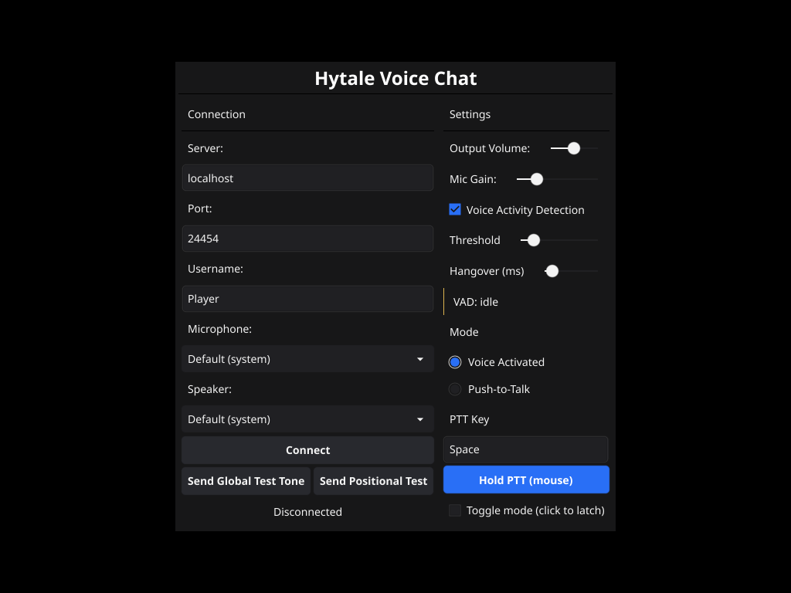

# Hytale Voice Chat

Proximity-based voice chat system for Hytale with multiple client options:

- **Voice Client**: Lightweight desktop voice client written in Go
- **Web Client**: Browser-based WebRTC client (no installation required)
- **Hytale Plugin**: Server-side plugin with integrated voice server written in Java

---

## 🎮 Voice Client

The voice client is a **standalone desktop application** that players install on their computers to enable voice chat.

### Features

- Cross-platform GUI (Windows, macOS, Linux)
- Built with Go + Fyne UI framework
- Microphone capture and audio playback using PortAudio
- UDP-based communication with the server
- No Java installation required



### Quick Start

```bash
cd voice-client

# Windows (PowerShell) - requires MSYS2 MinGW
$env:PATH = "C:\msys64\mingw64\bin;$env:PATH"
$env:CGO_ENABLED = "1"
go build -o HytaleVoiceChat.exe ./cmd/voice-client
./HytaleVoiceChat.exe

# macOS/Linux
go build -o HytaleVoiceChat ./cmd/voice-client
./HytaleVoiceChat
```

**📖 Full documentation:** [`voice-client/README.md`](voice-client/README.md)

---

## 🌐 Web Client

The web client is a **browser-based alternative** that requires no installation. Perfect for quick access or systems where native clients can't be installed.

### Features

- No installation required - runs directly in your browser
- WebRTC-based with built-in encryption
- Cross-platform (any modern browser)
- Same proximity-based audio as native client
- Microphone capture and audio playback via Web Audio API

### Quick Start

```bash
cd web-client

# Serve files with any static web server
python3 -m http.server 8080

# Then open http://localhost:8080 in your browser
```

**📖 Full documentation:** [`web-client/README.md`](web-client/README.md)

---

## 🔌 Hytale Plugin

The Java plugin runs **inside the Hytale server** and handles voice routing based on player proximity.

### Features

- Netty-based UDP server for native voice clients
- WebSocket server for WebRTC signaling (web clients)
- Proximity-based audio routing (configurable range)
- Player position tracking via Hytale API
- Authentication and session management
- In-game GUI for voice settings and group management
- Support for both native and web clients simultaneously


### Quick Start

```bash
cd hytale-plugin
./gradlew build

# Plugin JAR will be in: build/libs/
# Copy to your Hytale server's mods/ folder
```

**📖 Full documentation:** [`hytale-plugin/docs/SETUP.md`](hytale-plugin/docs/SETUP.md)

---

## 📂 Project Structure

```text
hytale-voice-chat/
├── voice-client/          # Go desktop client (standalone app)
│   ├── cmd/               # CLI entry points
│   ├── internal/          # Go client implementation
│   └── README.md          # Go client documentation
│
├── web-client/            # Browser-based WebRTC client
│   ├── js/                # JavaScript modules
│   ├── css/               # Stylesheets
│   ├── index.html         # Main web page
│   └── README.md          # Web client documentation
│
├── hytale-plugin/         # Java server plugin
│   ├── src/               # Plugin source code
│   ├── common/            # Shared Java models
│   ├── docs/              # Plugin documentation
│   ├── build.gradle       # Build configuration
│   └── gradlew            # Gradle wrapper
│
├── docs/                  # Architecture documentation
│   └── WEBRTC_ARCHITECTURE.md  # WebRTC design docs
│
├── .gitignore
└── README.md              # This file
```

---

## 🚀 Getting Started

### For Players (Client Setup)

**Option 1: Native Desktop Client**

1. Download the voice client for your platform
2. Run `HytaleVoiceChat` executable
3. Enter your Hytale username and server address
   - Supports URLs: `hytale.techynoodle.com` (auto-uses port 24454)
   - Or with custom port: `hytale.techynoodle.com:25000`
4. Click "Connect" and start talking!

See [`voice-client/README.md`](voice-client/README.md) for detailed instructions.

**Option 2: Web Browser Client**

1. Navigate to the hosted web client URL (provided by your server admin)
2. Enter your Hytale username
3. Enter the server address
4. Click "Connect" and allow microphone access
5. Start talking!

See [`web-client/README.md`](web-client/README.md) for detailed instructions.

### For Server Admins (Plugin Setup)

1. Build the plugin:

   ```bash
   cd hytale-plugin
   ./gradlew build
   ```
  
2. Copy JAR from `hytale-plugin/build/libs/` to your Hytale server's `mods/` folder
3. Start/restart the Hytale server
4. Configure settings in `config/voicechat.yml` (if needed)

**Keeping Updated:** The plugin uses the Hytale Server API from Maven. To check for and update to new API versions, run `hytale-plugin/check-hytale-version.ps1` or edit `hytale_server_version` in `hytale-plugin/gradle.properties`. See [`hytale-plugin/docs/HYTALE_VERSION_MANAGEMENT.md`](hytale-plugin/docs/HYTALE_VERSION_MANAGEMENT.md) for details.

See [`hytale-plugin/docs/SETUP.md`](hytale-plugin/docs/SETUP.md) for detailed instructions.

---

## 📚 Documentation

- **Voice Client**: See [`voice-client/README.md`](voice-client/README.md)
- **Hytale Plugin**: See [`hytale-plugin/docs/`](hytale-plugin/docs/) directory for detailed guides:
  - [Setup Guide](hytale-plugin/docs/SETUP.md)
  - [Testing Guide](hytale-plugin/docs/TEST.md)
  - [Audio Testing](hytale-plugin/docs/AUDIO_TESTING.md)
  - [Authentication Flow](hytale-plugin/docs/AUTHENTICATION.md)
  - [Test Scenarios](hytale-plugin/docs/TEST_SCENARIOS.md)

---

## 🛠️ Development

### Prerequisites

- **Voice Client**: Go 1.25+, PortAudio
- **Hytale Plugin**: Java 25, Gradle (no local Hytale API files needed - uses Maven)

### Building Both Components

```bash
# Build Java plugin
cd hytale-plugin && ./gradlew build

# Build Go client
cd voice-client && go build -o HytaleVoiceChat ./cmd/voice-client
```

---

## 📝 License

This project is for educational/personal use with Hytale.
